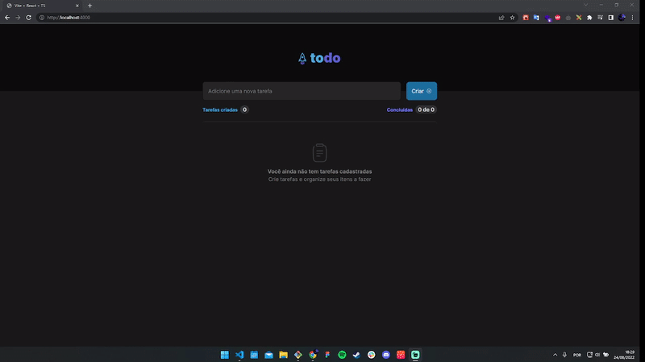

<h1 align='center'>Todo List</h1>

<h1 align="center">
  
</h1>

## About 🚀

First project of the updated track of react.
A simple project that addresses basic concepts such as immutability, properties, communication between components, typescript and css modules.

---
## Techs ✔
- [React JS](https://reactjs.org/)
- [Typescript](https://www.typescriptlang.org/)
- [Vite](https://vitejs.dev/)
- [CSS Modules](https://github.com/css-modules/css-modules)
---

## How to install 💻

```bash
#First clone this project on your preference path

$ git clone https://github.com/Luan4560/01-challenge-react-ignite-2022.git

# Then got to you path, open the project and install the dependecies.

$ yarn or npm install

# After that, just initilialize the project with:

$ yarn dev
```
---

This project was made by Luan Nascimento 🤘 and it is the first challenge on new track updated of ignite bootcamp provided from [Rocketseat](https://rocketseat.com.br/) 🚀

